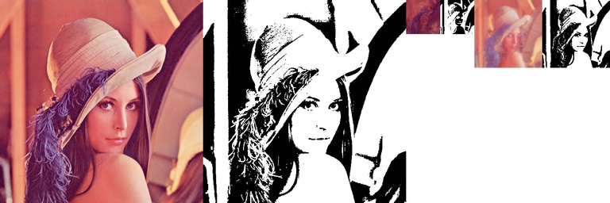
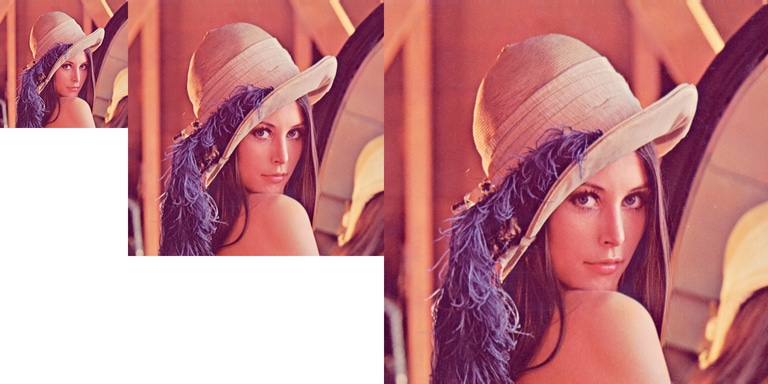

# ImThreshold-demo

Demo of [ImThreshold](https://github.com/ImageProcessing-ElectronicPublications/imthreshold).

----

See [>>> demo of ImThreshold >>>](./imthreshold)

---

Main directions:

 1) DjVuL - An image bundle on the mask + foreground + background using "Multi-scale binarization";  
  
 2) PMean - management of noise in images;  
   
 3) HRIS - image scaling up.  
   

---

 Website: https://sourceforge.net/projects/imthreshold/

 GIT: https://github.com/ImageProcessing-ElectronicPublications/imthreshold

 BookScanLib.ru Website: http://djvu-soft.narod.ru/

 Email: zvezdochiot@users.sourceforge.net

