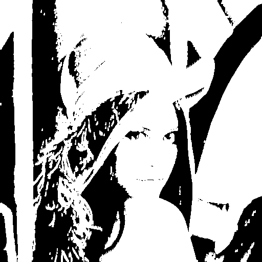
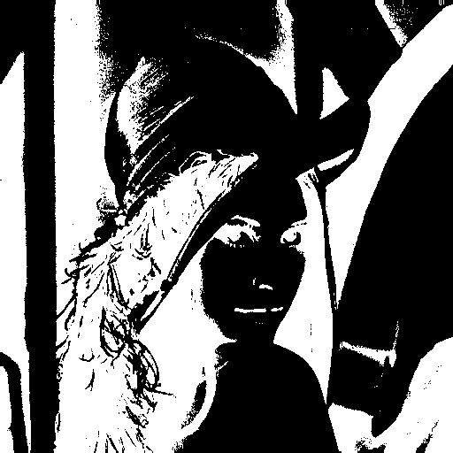
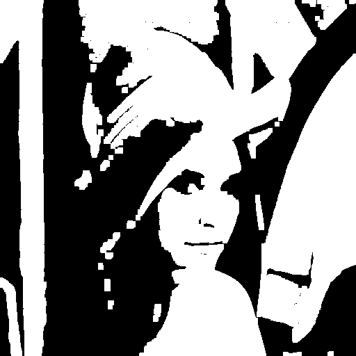

# ImThreshold-demo

ImThreshold.  
Linux fork BookScanLib.ru (http://djvu-soft.narod.ru/bookscanlib/).  
It's a set of command line tools to create color images of djvu.  

```sh
imthreshold-fdespeckle
```

origin:  


---

`-m hist`:  


`-m invert`:  


`-m mag2`:  


`-m minmax`:  


`-m neuro`:  


`-m simple`:  


`-m smearing`:  


---

 2022 zvezdochiot.  
 Website: https://sourceforge.net/projects/imthreshold/  
 BookScanLib.ru Website: http://djvu-soft.narod.ru/  
 Email: zvezdochiot@users.sourceforge.net  
