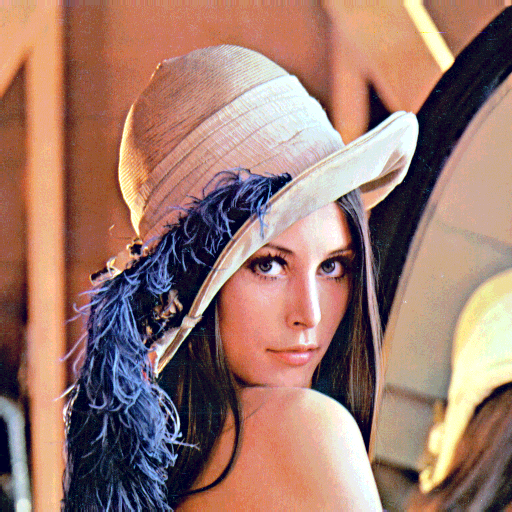
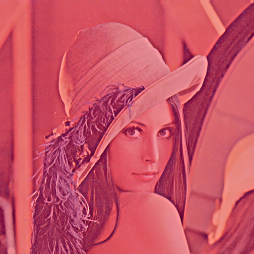
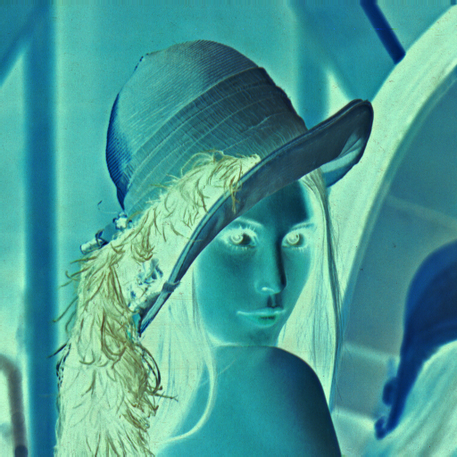
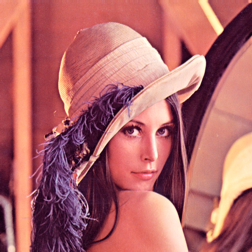
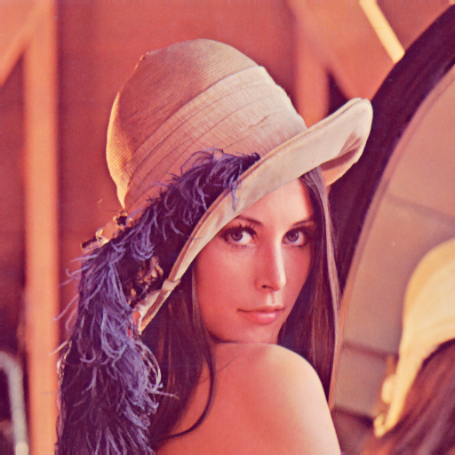
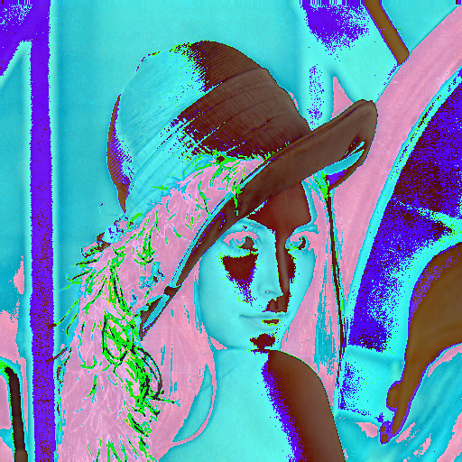
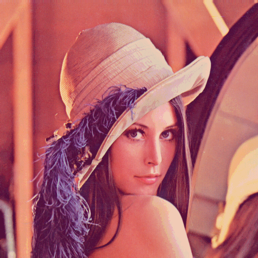
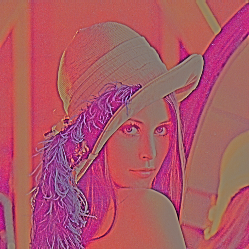

# ImThreshold-demo

ImThreshold.  
Linux fork BookScanLib.ru (http://djvu-soft.narod.ru/bookscanlib/).  
It's a set of command line tools to create color images of djvu.  

```sh
imthreshold-filter
```

origin:  


---

`-f adsmooth`:  


`-f bimod`:  


`-f blur`:  


`-f bwc`:  


`-f cluster`:  


`-f denoise`:  


`-f greynorm`:  


`-f greyworld`:  


`-f illumc`:  


`-f invert`:  


`-f levelmean`:  


`-f levelsigma`:  


`-f levelsize`:  


`-f mclose`:  


`-f mdilate`:  


`-f merose`:  


`-f mirror`:  


`-f monocolor`:  


`-f mopen`:  


`-f peron`:  


`-f posterize`:  


`-f quant`:  


`-f retinex`:  


`-f rs`:  


`-f selgauss`:  


`-f shrink`:  


`-f unripple`:  


`-f unsharp`:  


`-f whitefill`:  


`-f wiener`:  


---

 2022 zvezdochiot.  
 Website: https://sourceforge.net/projects/imthreshold/  
 BookScanLib.ru Website: http://djvu-soft.narod.ru/  
 Email: zvezdochiot@users.sourceforge.net  
