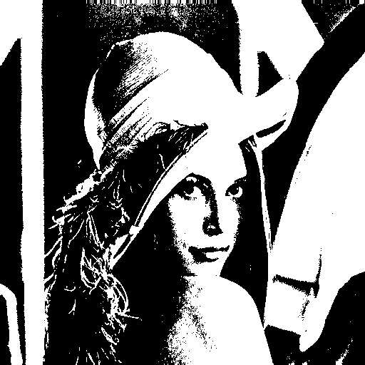
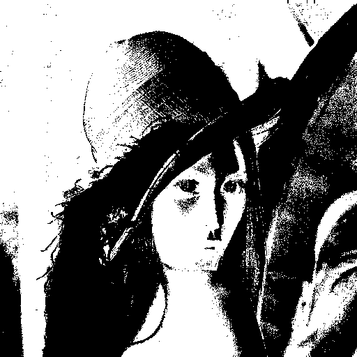
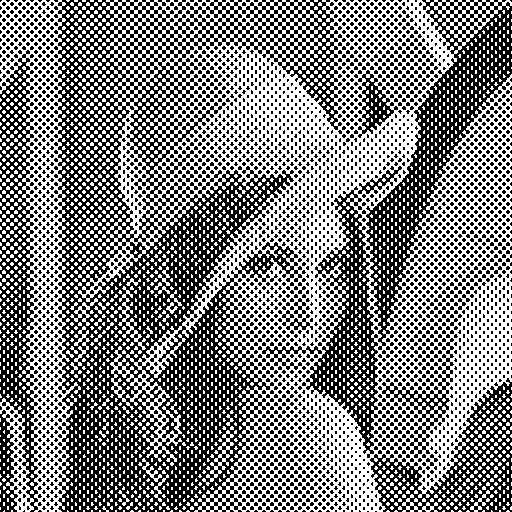
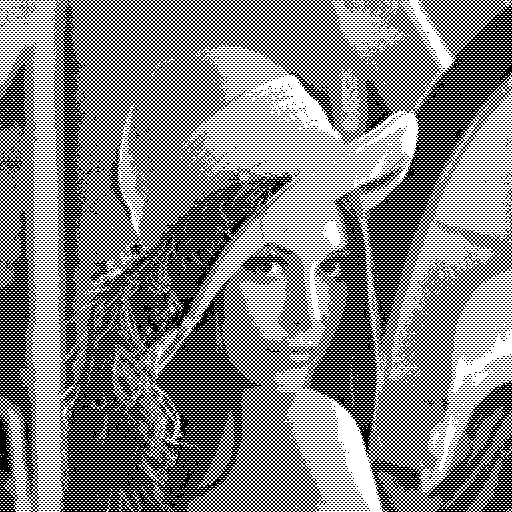
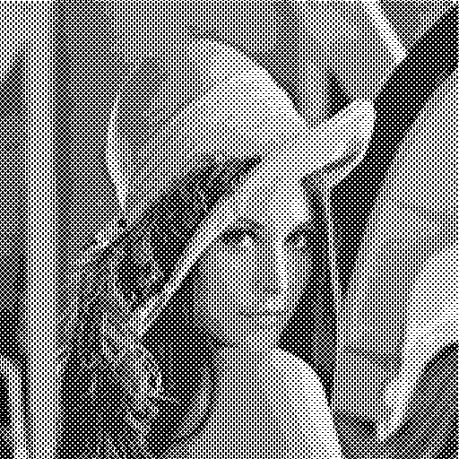

# ImThreshold-demo

ImThreshold.  
Linux fork BookScanLib.ru (http://djvu-soft.narod.ru/bookscanlib/).  
It's a set of command line tools to create color images of djvu.  

```sh
imthreshold-tglobal
```

origin:  


---

`-f bimod`:  


`-f bimodc`:  


`-f color`:  


`-f dither`:  


`-f dithh`:  


`-f ditho`:  


`-f dithq`:  


`-f ditht`:  


`-f entropy`:  


`-f grad`:  


`-f janni`:  


`-f kmeans`:  


`-f otsu`:  


`-f quadmod`:  


`-f rot`:  


`-f tsai`:  


---

 2022 zvezdochiot.  
 Website: https://sourceforge.net/projects/imthreshold/  
 BookScanLib.ru Website: http://djvu-soft.narod.ru/  
 Email: zvezdochiot@users.sourceforge.net  
