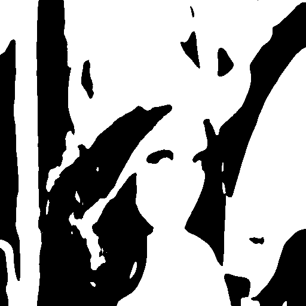
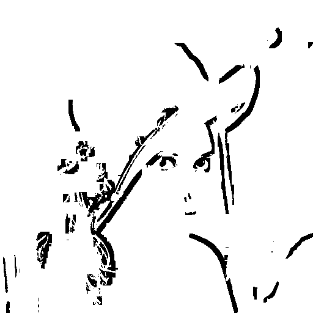
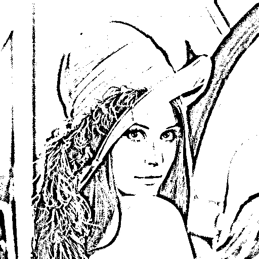
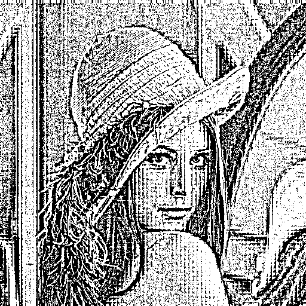
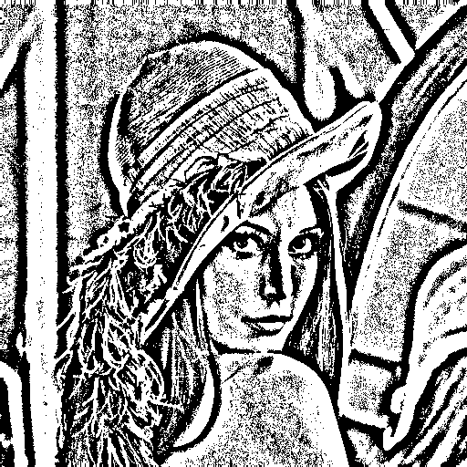
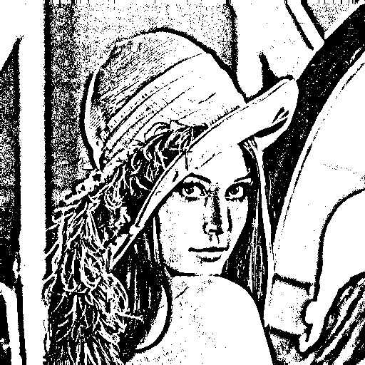
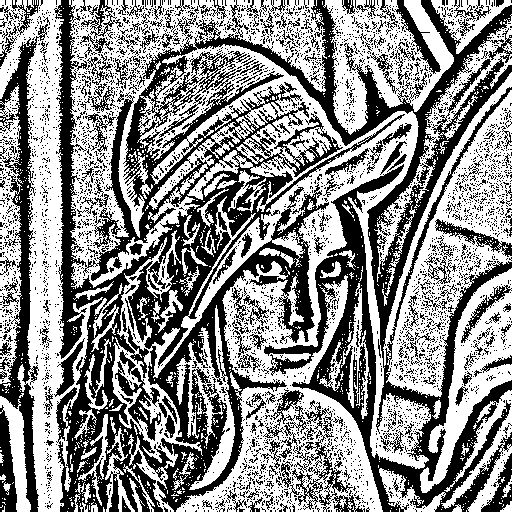
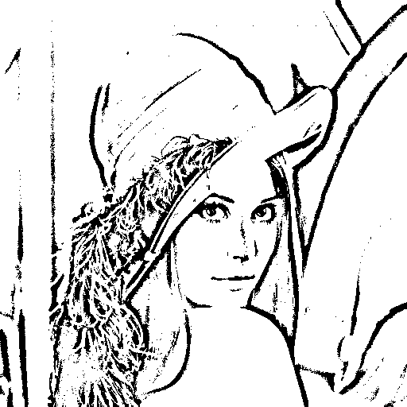

# ImThreshold-demo

ImThreshold.  
Linux fork BookScanLib.ru (http://djvu-soft.narod.ru/bookscanlib/).  
It's a set of command line tools to create color images of djvu.  

```sh
imthreshold-tlocal
```

origin:  


---

`-f abutaleb`:  


`-f bernsen`:  


`-f bimod`:  


`-f blur`:  


`-f chistian`:  


`-f dalg`:  


`-f edge`:  


`-f gravure`:  


`-f mscale`:  


`-f niblack`:  


`-f sauvola`:  


`-f size`:  


---

 2022 zvezdochiot.  
 Website: https://sourceforge.net/projects/imthreshold/  
 BookScanLib.ru Website: http://djvu-soft.narod.ru/  
 Email: zvezdochiot@users.sourceforge.net  
